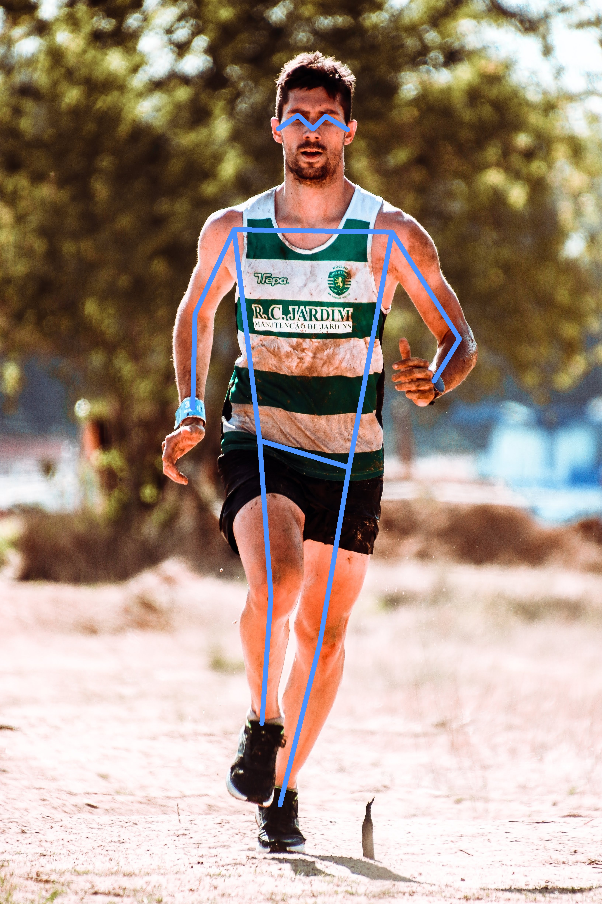

# Human Pose Estimation using Keypoint RCNN in PyTorch

## Directory Structure

**All the code files and folders follow the following structure.**

```

├── images
│   ├── image_1.png
│    
├── run_keypoint_rcnn.py
├── run_keypoint_rcnn.ipynb
├── requirements.txt
│       
└── README.md
```


## Instructions


To run the Python script, execute `python run_pose_estimation.py`

To run the jupyter notebook, open it in a Jupyter console and run cells sequentially.


## Human Pose Estimation Output


